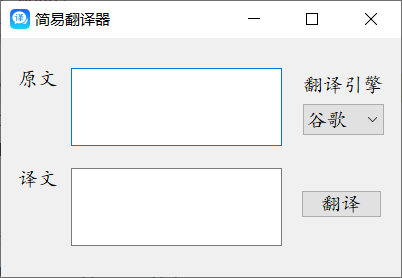

# 谷歌、有道、百度翻译

# 项目结构
.\
├── ui\
│   ├── __init__.py\
│   ├── MainWindow.ui\
│   └── MainWindow.py\
├── javascript\
│   ├── youdao.js\
│   ├── google.js\
│   └── baidu.js\
├── assets\
│   ├── s1.png\
│   └── icon.png\
├── api\
│   ├── youdao.py\
│   ├── google.py\
│   ├── baidu.py\
│   └── __init__.py\
├── README.md\
├── Demo v2.0.py\
└── Demo v1.0.py\

`ui`: 存放界面相关文件的文件夹  
`javascript`: 存放谷歌、有道、百度翻译加密参数的 js 代码的文件夹  
`assets`: 存放图标和截图的文件夹  
`api`: 存放爬取翻译内容的 py 文件，其中 __init__.py 保证 api 目录是一个可导入的包，而非普通的文件夹  
`README.md`: 项目描述文件  
`Demo v2.0.py`: 2.0 版本（美化了界面）  
`Demo v1.0.py`: 1.0 版本

## 运行环境

> Python 版本
* Python 3.7
> 第三方库支持
* requests
* js2py
* PyQt5

## 使用方法
在终端中运行`python Demo.py`命令

## 运行结果

## 计划
- [x] 美化界面
- [ ] 打包为可执行文件
