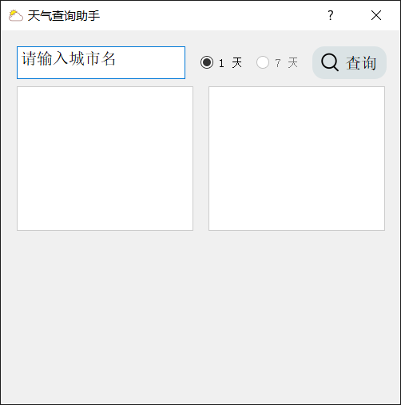
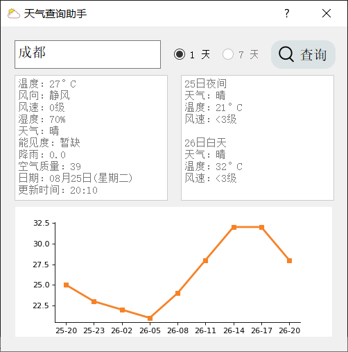
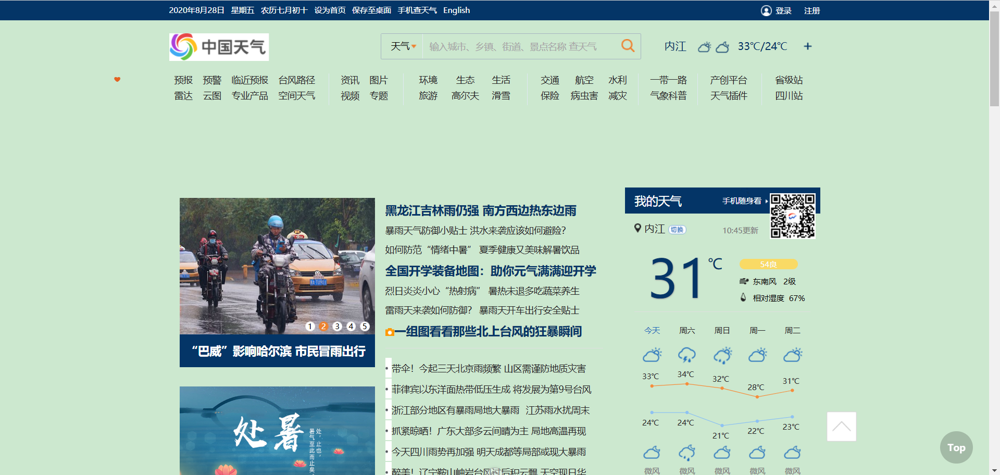
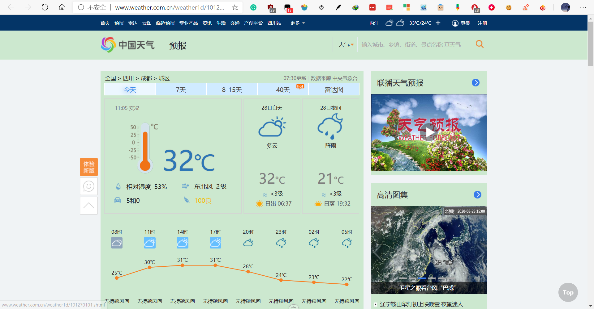
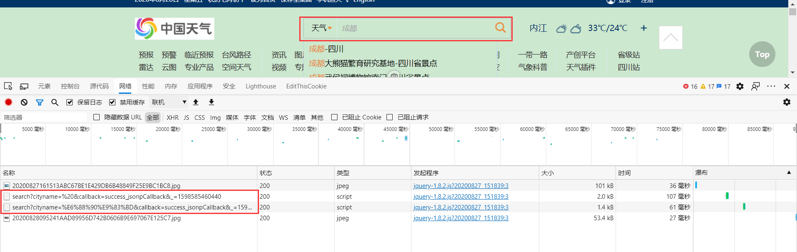
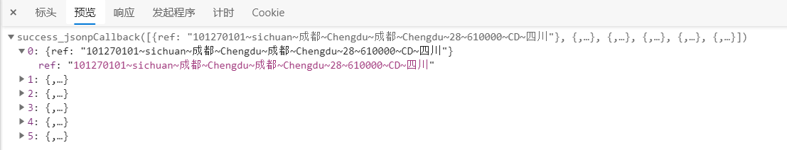
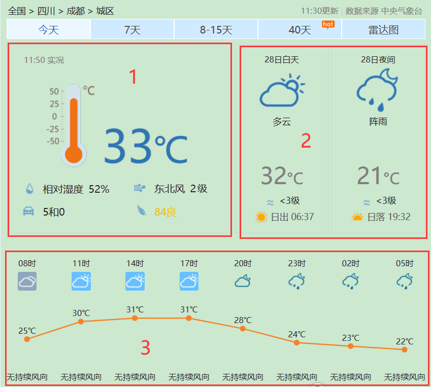
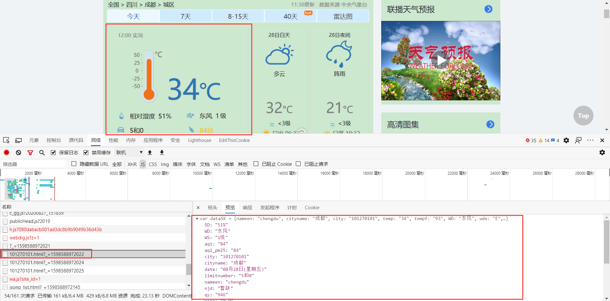
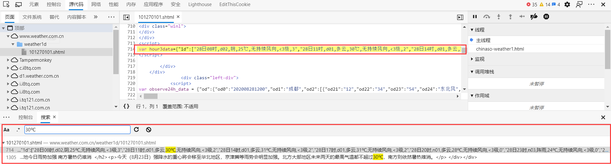

# 天气查询助手

## 项目结构

.  
├── README.md  
├── api  
│   ├── __init__.py  
│   └── gw.py  
├── assets  
│   ├── search.png  
│   └── weather.ico  
├── demo.py  
└── ui  
    ├── MainWindow.py  
    ├── MainWindow.ui  
    └── __init__.py  

`README.md`: 项目描述文件  
`api`: 获取天气信息的接口  
`assets`: 图标  
`demo.py`: 主程序  
`ui`: qt-designer 界面文件

## 第三方库依赖

`requests`
`BeautifulSoup`
`matplotlib`
`PyQt5`

## 运行

在终端运行命令：

```bash
python demo.py
```

## 效果

<center>


</center>

## 实现过程

爬取的网址：[中国天气网]( http://www.weather.com.cn/ )，如下图所示。



先随便搜索一下试试，当前的 URL 为：[http://www.weather.com.cn/weather1d/101270101.shtml#input](http://www.weather.com.cn/weather1d/101270101.shtml#input)



URL 中的 101270101 猜测应该是城市的 id 之类的，那么如果要查询不同的城市的天气数据，首先得找到城市名和这个 id 的对应关系。
回到最初搜索的地方，观察一下网络请求。



发现网络面板中有含有 search 关键字的请求，具体内容过如下：



Nice！这个请求里面包含了城市的 id。请求的 URL 为：[http://toy1.weather.com.cn/search?cityname=%E6%88%90%E9%83%BD&callback=success_jsonpCallback&_=1598586444643](http://toy1.weather.com.cn/search?cityname=%E6%88%90%E9%83%BD&callback=success_jsonpCallback&_=1598586444643)，请求方法为 GET，然后分析一下具体的请求参数：

>'cityname': 成都
>
>'callback': success_jsonpCallback
>
>'_': 1598586444643

cityname 是城市的名称，callback 不知其具体意义，_ 一看就知道是时间戳。
那这样就很简单了，写一段简单的代码就可以获取到城市的 id：

```python
headers = {
  	"User-agent": "Mozilla/5.0 (Windows NT 10.0; Win64; x64) AppleWebKit/537.36 (KHTML, like Gecko) Chrome/84.0.4147.125 Safari/537.36 Edg/84.0.522.59",
        "Referer": "http://www.weather.com.cn/weather1d/101271201.shtml"
}
city_name = "成都"
timestamp = int(time.time() * 1000)
url = f"http://toy1.weather.com.cn/search?cityname={city_name}&callback=success_jsonpCallback&_={timestamp}"
response = requests.get(url, headers=headers)
city_ip = re.findall(r"\d{9}", response.text)[0]
print(city_ip)
```

> 需要注意的是，如果 headers 里不添加 Referer，就会出现 403 错误码，在这里也是栽了跟头。

解决了城市 ip 的问题，接下来就要获取页面上的天气数据了。
把页面上的主要数据分为 3 个部分，如下所示。



对于第 1 板块的数据，在源代码中并没有发现，说明是异步加载的数据。
然后在网络面板中发现了一个请求，里面由对应的信息，如下所示：



该请求的请求 URL 为：[http://d1.weather.com.cn/sk_2d/101270101.html?_=1598588972022](http://d1.weather.com.cn/sk_2d/101270101.html?_=1598588972022)，之前获取到的城市 ip 在这同样适用。写一段代码来获取这个数据：

```python
cip = "101270101"
timestamp = int(time.time() * 1000)
url = f"http://d1.weather.com.cn/sk_2d/{cip}.html?_={timestamp}"
response = requests.get(url)
response.encoding = "utf-8"
content = response.text
```

然后解析数据：

```python
# 温度
temp = re.findall('"temp":"(.*?)"', content)[0] + "°C"
# 风向
wd = re.findall('"WD":"(.*?)"', content)[0]
# 风速
ws = re.findall('"WS":"(.*?)"', content)[0]
# 湿度
sd = re.findall('"SD":"(.*?)"', content)[0]
# 时间
time_ = re.findall('"time":"(.*?)"', content)[0]
# 天气状况
weather = re.findall('"weather":"(.*?)"', content)[0]
# 能见度
njd = re.findall('"njd":"(.*?)"', content)[0]
# 降雨
rain = re.findall('"rain":"(.*?)"', content)[0]
# 空气质量
aqi = re.findall('"aqi":"(.*?)"', content)[0]
# 日期
date_ = re.findall('"date":"(.*?)"', content)[0]
```

对于第 2 个板块的数据，在源代码中可以搜索到，因此我们可以直接用 requests 获取对应的数据，然后用 bs4 或者其他的解析库解析。

```python
url = f"http://www.weather.com.cn/weather1d/{cip}.shtml#input"
response = requests.get(url)
response.encoding = "utf-8"
html = response.text
soup = BeautifulSoup(html, "lxml")

# 第一列数据
li1 = soup.select("div.t > ul.clearfix > li")[0]
# 白天 or 夜间
type1 = li1.select("h1")[0].text.strip()
# 天气状况
weather1 = li1.select("p.wea")[0].text.strip()
# 温度
temp1 = li1.select("p.tem")[0].text.strip()
# 风速
ws1 = li1.select("p.win > span")[0].text.strip()
# 第二列数据
li2 = soup.select("div.t > ul.clearfix > li")[1]
type2 = li2.select("h1")[0].text.strip()
weather2 = li2.select("p.wea")[0].text.strip()
temp2 = li2.select("p.tem")[0].text.strip()
ws2 = li2.select("p.win > span")[0].text.strip()
```

对于第 3 个板块的数据，在源代码中也不能直接搜索到，应该是 js 返回的数据，但找了很久，我都没有找到。最后利用全局搜索（Ctrl + Shift + F），在 html 文档的 script 标签中找到了对应的数据，如下所示：



这样，要获取数据就很简单了，直接用 requests 库获取页面，然后用正则表达式或者解析库提取 script 标签中的数据：

```python
cip = "101270101 "
url = f"ttp://www.weather.com.cn/weather1d/{cip}.shtml#input"
response = requests.get(url, headers=headers)
response.encoding = "utf-8"
html = response.text
soup = BeautifulSoup(html, "lxml")
script = soup.select("div#today > script")[1].text.strip().strip("var hour3data=")
json_ = json.loads(script)
data = json_["1d"]  # 获取 1 天的数据
time_list = []
temp_list = []
for i in range(len(data)):
      time_ = data[i].split(",")[0]
      temp = data[i].split(",")[3]
      time_list.append(time_)
      temp_list.append(temp)
      time_list = [re.findall("\d+", i)[0] + "-" + re.findall("\d+", i)[1] for i in time_list]
      temp_list = [int(i.strip("℃")) for i in temp_list]
```

至此，页面上主要的数据就获取完了，接下来将其输出就行了。

## 还需改进的地方

- [ ]  ​	没有写获取连续 7 天数据的接口
- [ ]  ​	使用 pyinstaller 打包项目时文件太大（180 M），故没有上传
- [ ]  ​    窗口中显示的图片白边太多、曲线没有添加数据标签、纵轴温度的刻度没有细分
